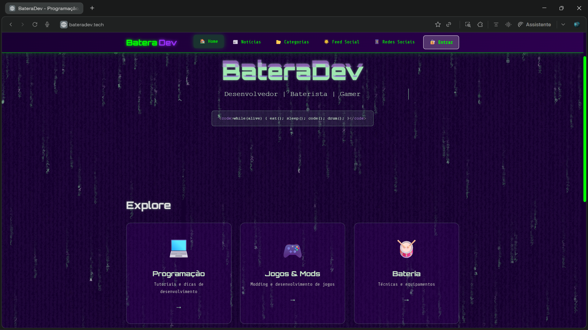
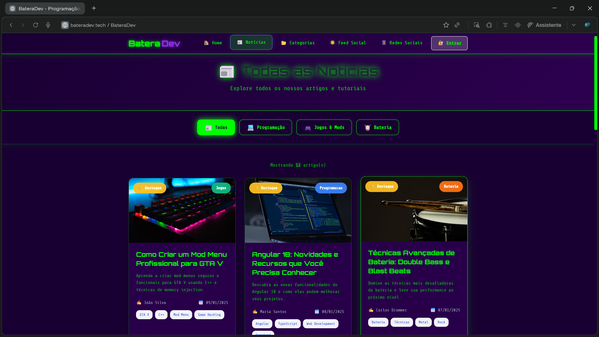
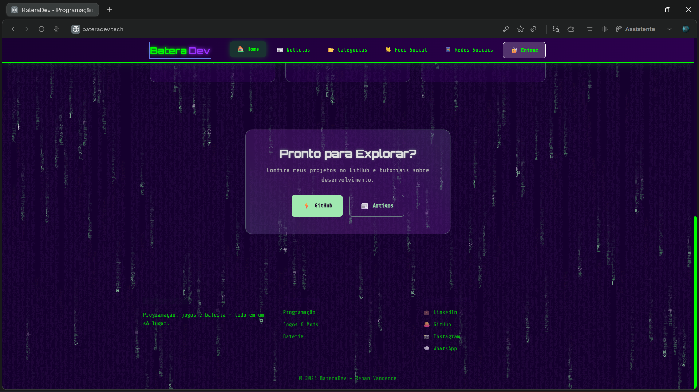

# BateraDev

Public frontend for my personal website, built to showcase my portfolio, articles, and experiments around software development, games/modding, and drums.

This repository contains only the public-facing part of the website. The real backend and the Flutter mobile app are not included in this repository for security and project organization reasons.

## About

BateraDev is an Angular web application with a terminal/matrix-inspired visual style. The project brings together a few areas of my work and learning:

- personal landing page and visual identity;
- article sections by category;
- public news/articles page;
- GitHub portfolio area;
- login, registration, social feed, and profile screens prepared for API integration.

Some features depend on an external backend. In this public repository, sensitive endpoints, credentials, and private implementation details were removed or replaced with safe example values.

## Screenshots

| Home | Articles |
| --- | --- |
|  |  |

| Explore section |
| --- |
|  |

## Tech Stack

- Angular 13
- TypeScript
- RxJS
- Angular Router
- Reactive Forms
- Express for serving the production build locally

## Project Structure

```text
src/
  app/
    core/                 # shared guards, interceptors, and services
    features/             # auth, feed, profile, and GitHub portfolio pages
    home/                 # home page
    noticias/             # public articles/news listing
    categoria/            # category-based article pages
    services/             # local article data
    shared/               # TypeScript models
```

## Running Locally

Install dependencies:

```bash
npm install
```

Run the development server:

```bash
npm run dev
```

Open:

```text
http://127.0.0.1:4200
```

## Production Build

Build the project:

```bash
npm run build
```

Serve the production build locally:

```bash
npm start
```

Open:

```text
http://127.0.0.1:3000
```

## Security Notes

This repository was prepared for public release:

- real `.env` files are not versioned;
- the real backend is not included in the public repository;
- the Flutter mobile app will be maintained in a separate repository;
- credentials, tokens, and private URLs should not be added to the source code.

Before publishing new changes, review the Git status:

```bash
git status --short
```

You can also search for accidental placeholders or secrets:

```powershell
Select-String -Path src\**\*,src\index.html,package-lock.json,package.json,.npmrc -Pattern "ACCESS_TOKEN","DB_PASSWORD","SECRET_KEY","APP_BASE_URL" -CaseSensitive:$false
```

## License

Distributed under the MIT License. See the `LICENSE` file for more information.
